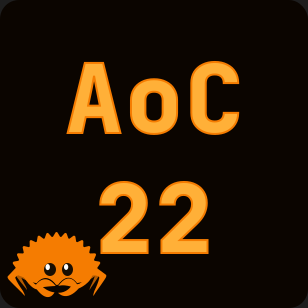

# Advent Of Code 2022 
### A compilation of 2022 advent of code solutions written in Rust

## How to use
Create an `inputs` folder in `assets` and populate it with the files corresponding to each day of advent of code. Or copy `examples` folder and rename it to `inputs`. Next, paste your advent of code data into the appropriate files in the newly created folder and you're done.

To test the solutions on sample data type `cargo test`.\
To compile and run the program with the input data type `cargo run --release -- [DAY_NUMBER]`.
